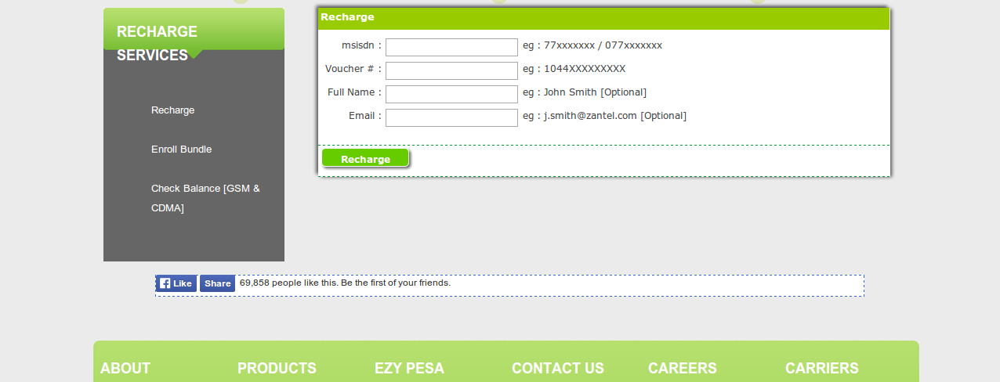

# Zantel

*A short story of how easy it was to "hack" one of the biggest Tanzanian network providers*
    

  

#### 1. How to get there
 

3G modems are the most common way to get access to the Internet. The prices are quite fair. For 5Gb/month you have to spend around 25.000TZS (16$). The whole mobile operator thing is based on so called "voucher" cards. You can buy them everywhere at any time. On the back there is a 13 digits code. To recharge your phone/modem you enter the code to your phone.
You are also able to send this money to other phones using [USSD codes](http://en.wikipedia.org/wiki/Unstructured_Supplementary_Service_Data).

Personally I'm using ZANTEL. The company is a part of ETISALAT since 2007 and offers the best Internet connectivity in central Tanzania. 

 
#### 2. EzyRecharge
 

  

The website of [Zantel](http://zantel.com/) offers a service called EzyRecharge. Every visitor of the website is able to:

+ Check the balance by entering his phone number
+ Enroll bundles by entering his phone number
+ Recharge by entering his phone number and the 13 digits voucher number

The point is, that you don't have to enter **your phone number**. You can enter **any phone number**. And cause you don't have to register/login to this website you can enter a lot of phone numbers. A lot of phone numbers.

  
#### 3. Reverse Engineering
 
Reverse Engineering is a big word. In fact I just looked up some lines of JavaScript code at the Zantel website. The PHP driven page is sending the data (e.g. phone number) via HTTP Post requests to the Zantel server. By using the simple tool *curl* I reproduced those HTTP requests.
 
#### 4. First thoughts
 
First I thought about the balance thing. Cause checking the balance is important (you do this usually every day) I wrote a small website to check the balance and give you some extra information about your current usage.

Second functionality of this awesome EzyRecharge service was the bundle booki