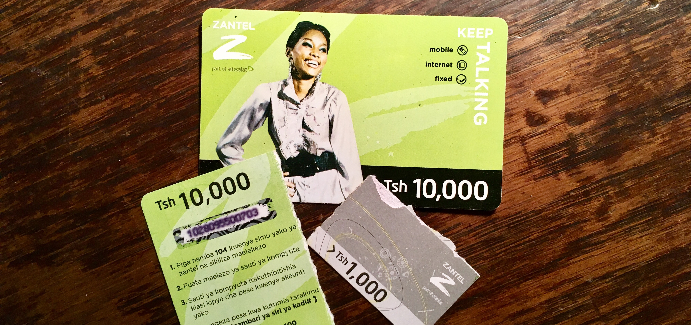
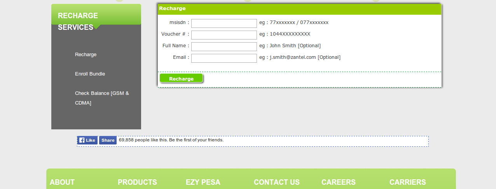

# Zantel Security 

*Notice: I wrote this story back in 2014 and hesitated to publish it until they fixed the bug.*

## 1. How to get there

3G modems are the most common way to access the Internet in Tanzania. The prices are quite fair. For 5Gb/month you have to spend around 25000TZS (16USD). The whole mobile operator thing is based on so called "voucher" cards. You can buy them everywhere at any time. On the back you find a 13 digits code. To recharge your phone/modem you enter the code on your phone.
You are also able to send this money to other phones using [USSD codes](http://en.wikipedia.org/wiki/Unstructured_Supplementary_Service_Data).

Personally I'm using ZANTEL. The company is a part of ETISALAT since 2007 and offers the best Internet connectivity. 

## 2. EzyRecharge

The [Zantel website](http://zantel.com/) offers a service called EzyRecharge. Every visitor of the website is able to:

+ Check the balance by entering his phone number
+ Enroll bundles by entering his phone number
+ Recharge by entering his phone number and the 13 digits voucher number

The point is, that you don't have to enter **your phone number**. You can enter **any phone number**. And cause you don't have to register/login to this website you can enter a lot of phone numbers. A lot of phone numbers.

## 3. Reverse Engineering

Reverse Engineering is a big word. In fact I just looked up some lines of JavaScript code at the Zantel website. The PHP driven page is sending the data (e.g. phone number) via HTTP Post requests to the Zantel server. By using *curl* I reproduced these HTTP requests.

## 4. First thoughts

First I thought about the balance thing. Cause checking the balance is important (you do this usually every day) I wrote a small website to check the balance that gives you some extra information about your current usage.

Second functionality of this awesome EzyRecharge service was the bundle booking thing. In theory you are able to write a script that creates a database of used Zantel numbers with their current balance. If the balance exceeds a certain amount  (e.g. 1000TZS-0.5USD) you can book anyone, evene strangers a new bundle. Without asking them! And you can automate this process. Again, we are just talking about standard HTTP POST requests.

## 5. The third feature - printing money

The third feature is awesome. Just enter your phone and a valid voucher number and you are able to recharge your account. But how about entering more than one voucher number ? How about entering 60 numbers per second ?

The idea is simple. Checking a lot of voucher numbers. I started with a valid number from a bought voucher card. And checked the following 60000 numbers. The result was impressing. I got three valid voucher numbers with an amount of 6000 TZS (1.5USD) in two hours.

I'm definitely not experienced with high performing scripts or security at all. I developed a lot of websites and wrote some small things in Node.js and ObjectiveC.
At this time I used a Shell Script with *curl* to send the POST requests. But the thing was to interesting to stop working on the small money printing machine.
I developed a small Node.js tool and maximised the numbers of requests to 60 per second by using multiple processes ([compute-cluster library](https://github.com/lloyd/node-compute-cluster)).

A single computer with an Internet connection for 24 hours is able to get over 100000TZS (60USD). Well that’s a lot of money. Especially in a country like Tanzania. And cause you can send this money to other phones, you can sell your "printed money" easily.

## 6. Moral Thoughts

I never used the scripts to get money. It was more a "prove of concept", than really getting rich. Cause there is one big problem using this "money printing machine":
you take the money from every Tanzanian citizen. There are people out who buy these voucher cards that are already	redeemed by the script. That's not cool!
So I informed Zantel. I wrote several mails to several addresses. But never got a response.

## 7. Update 2016

It seems they fixed their security flaw a few weeks ago. You have to authenticate your number before using the [Ezy Self Care Service](http://www.zantel.com/ezyrecharge/auth.php).

